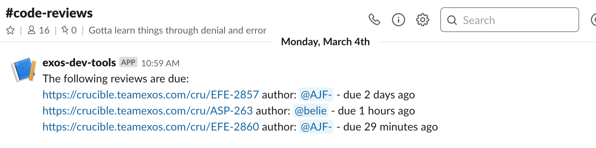

# due-code-review-notifier
The goal of this simple function is to notify a group of developers about due code reviews. 
Code reviews are pulled from Crucible, and the notifcations are sent via Slack.

This function can run in AWS Lambda. It integrates with Crucible and Slack APIs.
It can use AWS CloudWatch to be executed daily.

Slack Notifications Sample

